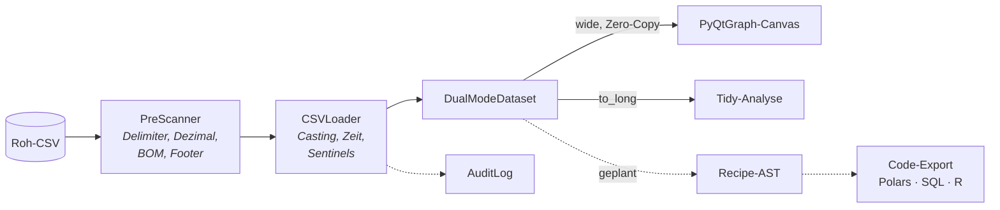

<div align="center">

# Datualizer

**Tidy Data Wrangling & Visualisierung für Mess- und Sensordaten, die sich nicht an Konventionen halten.**

*Weil `messung_final_v3_WIRKLICH_final.csv` kein Datenformat ist.*


</div>

---

## Worum geht's?

Jeder, der schon mal an einem Prüfstand stand, kennt das: Der Datenlogger exportiert *irgendwas*. Mal mit Semikolon, mal mit deutschem Dezimalkomma, mal mit einem Footer voller Statistiken. Mal bricht der Export mitten in der Zeile ab, und mal steht in der Spalte `Konzentration` plötzlich `20 °C`. Die übliche Antwort darauf sind 400 Zeilen Einweg-Pandas-Skript pro Gerät, die nach dem nächsten Firmware-Update keiner mehr versteht.

**Datualizer** will das ändern:

1. **Robuste Ingestion:** Chaotische CSV-Exporte werden erkannt, eingelesen und *ehrlich* auditiert. Kaputte Werte werden protokolliert statt still verschluckt.
2. **Deklarative Transformationen:** Jeder Bereinigungsschritt ist ein serialisierbarer Rezept-Knoten (JSON-AST). Damit gibt es Undo/Redo, Replay auf die nächste Messung und Code-Export nach Python, SQL und R.
3. **Schnelle Visualisierung:** Native Desktop-Plots mit PyQtGraph, verlinkten Zeitachsen und Fadenkreuz, ohne Browser dazwischen.

Kurz gesagt: **PowerQuery-Ergonomie für Ingenieursdaten**, mit der Reproduzierbarkeit, die eine wissenschaftliche Auswertung braucht.

> [!NOTE]
> Datualizer ist ein Studierendenprojekt im frühen Stadium (Etappe 1 von 7). Die Architektur steht, die Grundlagen sind getestet, vieles ist noch Plan. Wer Feedback, Testdaten oder Meinungen hat: [Issue aufmachen](https://github.com/SeTi100/Datualizer/issues), ausdrücklich erwünscht.

---

## Features

### ✅ Schon da (Etappe 1)

| Bereich | Was es kann |
|---|---|
| **PreScanner** | Erkennt Trennzeichen (`,` `;` `\t`), deutsches Dezimalkomma (`24,109`), Tausendertrenner, UTF-8-BOM, leeren Spalte-0-Header und Footer-Leerzeilen |
| **CSVLoader** | Polars-Ingestion ohne strikte Typprüfung, Zeitstempel (`HH:MM:SS`, ISO, deutsch) → relative `time_seconds`, Sentinel-Erkennung (`ERR`, `-999`, `#N/A`, …) mit `AuditLog` |
| **DualModeDataset** | Wide-Format als Primär-Engine, Zero-Copy-NumPy-Views für das Plotting, Tidy-Long-Format per `to_long()` auf Abruf |
| **Operatoren** | `clean_names` (Umlaut-Transliteration, Kanalnummern bleiben erhalten), `drop_footer`, `unpivot` |
| **Desktop-GUI** | Virtuelle Tabelle (`PolarsTableModel`), Multi-Kanal-Plot mit verlinkten X-Achsen und synchronem Fadenkreuz, Inspector mit Audit-Badge, 3-Panel-Docking-Layout |

### 🚧 Geplant

Block-Segmentation für Metadaten-Köpfe und Multi-Row-Header · Typ- und Rollen-Inferenz · Pydantic-Recipe-AST mit 10 Kern-Operatoren · `join_asof` für asynchrone Sensoren · Tidy-Axiom-Validierung · LTTB-Downsampling für > 1 Mio. Punkte · Multi-Y-Achsen · visueller Recipe-Editor · Code-Export (Polars / DuckDB-SQL / R Tidyverse) · portable Windows-`.exe`.

Details: [Roadmap](#roadmap) und [`docs/MASTER_ETAPPEN_PLAN.md`](docs/MASTER_ETAPPEN_PLAN.md).

---

## Schnellstart

### Installation

Voraussetzung: **Python ≥ 3.11**

```bash
git clone https://github.com/SeTi100/Datualizer.git
cd Datualizer
```

Mit [uv](https://docs.astral.sh/uv/) (empfohlen):

```bash
uv venv
uv pip install -e ".[dev]"
```

Oder klassisch mit pip:

```bash
python -m venv .venv
.venv\Scripts\activate
pip install -e ".[dev]"
```

### GUI starten

```bash
python -m datualizer_gui.app
```

Liegt `SA_testmessung_1.csv` im Arbeitsverzeichnis, wird sie automatisch geladen (4.931 Zeilen, 8 Kanäle). Alles andere geht über *File → Open CSV…* (`Ctrl+O`).

### Als Bibliothek nutzen

```python
from datualizer_core import load_csv

ds = load_csv("SA_testmessung_1.csv")      # PreScan + Laden + Audit in einem Rutsch

ds.shape                                   # (4931, 9)
ds.columns                                 # ['time_seconds', 'kanal_1', 'kanal_2', ...]

t = ds.to_numpy("time_seconds", allow_copy=False)   # Zero-Copy-View für Plots
long = ds.to_long()                                  # [time_seconds, channel, value]

if ds.audit_log.has_errors():
    print(ds.audit_log.to_dataframe())     # Welche Zelle war kaputt, und warum?
```

### Automatik schlägt vor, du entscheidest

Jede Heuristik (Zeitspalte, Spaltentypen, Long-Format, Messwert vs. Parameter, Namens-Vokabulare, Schwellen) ist über eine `IngestionConfig` überschreibbar. Und jedes geladene Dataset verrät, was die Automatik entschieden hat:

```python
from datualizer_core import ColumnKind, IngestionConfig, LongFormatConfig, load_csv

ds = load_csv("export.csv")
spec = ds.ingestion_spec                     # alle Entscheidungen, ausgeschrieben
print(spec.model_dump_json(indent=2))        # → speichern, prüfen, korrigieren …

cfg = IngestionConfig(
    column_kinds={"Versuch": ColumnKind.IDENTIFIER,           # Spaltentyp erzwingen
                  "Temperatur": ColumnKind.NUMERIC},          # konstanter Sensor bleibt Messkanal
    long_format=LongFormatConfig(variable_col="Groesse",      # Long-Rollen selbst festlegen
                                 value_col="Betrag",
                                 channel_attr_cols=["Masseinheit"]),
)
ds = load_csv("export.csv", config=cfg)      # … und reproduzierbar neu laden
```

**Messwert oder Parameter?** Eine numerische Spalte, die in jedem Run konstant ist (Sollwerte wie `Rotameter` oder `target_temperature`), wird als `ColumnKind.PARAMETER` eingestuft. Sie bleibt in `ds.df`, steht in `ds.parameters` und wird nicht als Kanal geplottet (`ds.channels`). Runs erkennt der Loader an Spalten wie `run_id` (`Vocabulary.run_tokens`), oder du gibst sie vor: `IngestionConfig(roles=RoleConfig(run_columns=["Charge"]))`. Ein Sensor, der zufällig konstant misst, sieht genauso aus wie ein Sollwert. Den stufst du per `column_kinds` zurück auf `NUMERIC`.

**Leere Spalten** werden markiert, nicht gelöscht: `ds.fill_ratio` liefert den Füllgrad pro Spalte, `ds.empty_columns` die Spalten ohne jeden Wert. Der Inspector zeigt leere Kanäle grau und abgewählt an.

**Runs** sind eine eigene Dimension: `ds.runs` zeigt pro Run Samples, Dauer, Median-Δt, Parameterwerte und ein `aborted`-Flag für Mini-Runs (Schwelle über `IngestionConfig(runs=RunConfig(aborted_fraction=0.1))`). `ds.channel_availability` liefert den Füllgrad je Run und Kanal, `ds.select_run((2,))` ein neues Dataset nur mit Run 2 und run-relativer Zeit. In der GUI plottet ein Klick in die Run-Tabelle nur diesen Run.

**Mehrere Dateien zusammenführen:** `load_csvs([alt, neu])` lädt mehrere Exporte als ein Dataset. Byte-identische Dateien erkennt der Loader am SHA-256 und lädt sie nur einmal (Audit: `duplicate_file`). Überlappende Snapshots werden über den Schlüssel dedupliziert (Zeit, bei Long-Tabellen Zeit und Variable): Die später angegebene Datei gewinnt, abweichende Werte der früheren Datei stehen als `merge_conflict` im Audit. Mit `IngestionConfig(merge=MergeConfig(conflict=MergeConflictMode.ERROR))` schlägt jeder Konflikt laut fehl, `MergeConfig(key_columns=[...])` setzt den Schlüssel selbst. `ds.sources` zeigt pro Datei Hash, übernommene, ersetzte und widersprüchliche Zeilen. Wide und Long oder verschiedene Dezimaltrenner werden nicht gemischt (`MergeError`). In der GUI: Mehrfachauswahl unter *Open CSV…* oder *File → Add CSV (merge)…*.

**Qualitäts-Flags** markieren verdächtige Samples, ohne die Daten anzufassen: `ds.quality_flags` ist eine Ereignistabelle (`row`, `channel`, `flag`) mit `gap` (Session-Lücke), `missing` bzw. `missing_calculated` (Leerfeld in einem Kanal, der im Run sonst Werte hat; Rechenkanäle getrennt), `stuck` (eingefrorener Sensor), `jump` (z. B. Nachfüllen), `dropout` (kurzer Ausreißer, der aufs alte Niveau zurückkehrt, z. B. Waage meldet 0.0) und `out_of_range`. Dazu gibt es `ds.quality_summary`, `ds.flag_mask(["dropout"], channel="masse")` und `ds.with_flag_columns()` (neue Tabelle mit einer Flag-Spalte pro Kanal). Schwellen stehen in `IngestionConfig(quality=QualityConfig(...))`; Sprungschwellen werden pro Kanal aus den Daten vorgeschlagen und landen ausgeschrieben in der Spec. Plausible Bereiche kennt nur der Nutzer: `QualityConfig(ranges={"Massenstrom Waage (g/s)": (0.0, None)})`. Der Plot verbindet keine Linien über Lücken, der Inspector zählt die Flags pro Kanal.

**Einheiten** gehen nicht verloren: `Massenstrom Waage (g/s)` wird zur Spalte `massenstrom_waage`, und `ds.units["massenstrom_waage"]` ist `"g/s"`. Bei Long-Exporten kommt die Einheit aus der Einheiten-Spalte. `ds.unitless_columns` zeigt Kanäle und Parameter ohne Einheit. Eigene Einheiten oder andere Schreibweisen im Header: `IngestionConfig(units=UnitConfig(units={"snad2": "°C"}, header_patterns=[r"/\s*(?P<unit>\S+)\s*$"]))`. Die Plot-Achsen zeigen die Einheit an. Steht die Einheit in der Zelle (`20 °C`), wird der Wert gelesen und die Einheit mit der Spalte abgeglichen; Widersprüche stehen in `ds.unit_conflicts` und im Audit (`unit_conflict`), der Wert bleibt erhalten.

Die mitgelieferten Namenslisten (`Vocabulary`) sind nur Startwerte und keine Konvention, an die sich deine Daten halten müssen.

### Tests

```bash
pytest -v
```

---

## Architektur



### Leitprinzipien

- **Robustness First:** Echte Messdaten sind keine sauberen Rechtecke. Die Ingestion muss mit dem Schlimmsten rechnen und darf trotzdem nicht abstürzen.
- **Wide *und* Long:** Wide für Mathematik und schnelles Plotting, Long für Tidy-Analysen. Beide Formate gibt es auf Abruf, keins wird erzwungen.
- **Nichts wird destruktiv verändert:** Keine In-place-Mutationen. Jede Operation ist ein nachvollziehbarer, umkehrbarer Schritt.
- **Ehrliches Audit:** Ein Wert, der nicht geparst werden kann, wird *protokolliert* und nicht still zu `NaN` gemacht.

---

## Projektstruktur

```
Datualizer/
├── datualizer_core/            # Engine, ohne GUI-Abhängigkeiten
│   ├── dataset.py              # DualModeDataset, AuditLog
│   ├── quality.py              # Qualitäts-Flags (Lücken, Dropout, Sprünge, …)
│   ├── ingestion/
│   │   ├── pre_scanner.py      # Format-Sniffing
│   │   ├── loader.py           # CSV → DualModeDataset
│   │   └── merge.py            # mehrere CSVs → ein Dataset (Dedupe)
│   └── pipeline/
│       └── operators.py        # clean_names, drop_footer, unpivot
├── datualizer_gui/             # PySide6-Desktop-App
│   ├── app.py                  # Einstiegspunkt
│   ├── main_window.py
│   └── components/             # Tabelle, Plot, Inspector, Recipe-Panel
├── tests/
│   └── fixtures/runs_export/   # Echte Pipeline-Exporte als Testkorpus
└── docs/
    ├── MASTER_ETAPPEN_PLAN.md
    └── DATENKATALOG_RUNS_EXPORT.md
```

---

## Roadmap

| Etappe | Thema | Status |
|:---:|---|:---:|
| 1 | Minimal End-to-End Tracer Bullet | ✅ |
| 2 | Ingestion-Festung für chaotische Realdaten | 🔜 in Arbeit |
| 3 | Tidy- & Reshaping-DSL (JSON-AST, 10 Operatoren, `join_asof`) | ⏳ |
| 4 | Tidy-Axiom-Validierung & KI-gestützte Recipe-Reparatur | ⏳ |
| 5 | High-Performance-Visualisierung (LTTB, Multi-Y, ROI) | ⏳ |
| 6 | Desktop-UX & Multi-Target-Code-Export | ⏳ |
| 7 | Beta-Härtung & Standalone-Windows-Binary | ⏳ |

---

## Testdaten

Datualizer wird gegen echte Exporte entwickelt, nicht gegen Lehrbuch-CSVs. Der Korpus in [`tests/fixtures/runs_export/`](tests/fixtures/runs_export/) enthält unter anderem:

- abgebrochene Runs
- Duplikate
- Dateinamen, die über ihr eigenes Format lügen
- Sensor-Dropouts als `0.0`
- Parameter namens `snad2`

Was genau darin steckt und welche Anforderungen daraus folgen, steht im [Datenkatalog](docs/DATENKATALOG_RUNS_EXPORT.md).

**Du hast besonders hässliche Messdaten?** Her damit (gern anonymisiert). Jede neue Pathologie macht Datualizer robuster.

---

## Mitmachen

Issues, Bug-Reports und Pull Requests sind willkommen. KI-Agenten (und gern auch Menschen) lesen vorher [`AGENTS.md`](AGENTS.md): Dort stehen Ziel, Prinzipien, Arbeitsablauf und die nächsten offenen Punkte. Ein paar Hausregeln:

- `pytest -v` muss grün sein, bevor etwas gemergt wird.
- Neue Ingestion-Features bekommen eine Fixture mit dem Problemfall dazu.
- Keine In-place-Mutationen von DataFrames (siehe Leitprinzipien).

---

## Lizenz

Noch nicht festgelegt. Bis dahin gilt: alle Rechte vorbehalten. Wer den Code nutzen möchte, fragt kurz nach.

---

<div align="center">
<sub>Gebaut mit Polars, Qt und einer gesunden Abneigung gegen Excel-Exporte.</sub>
</div>
