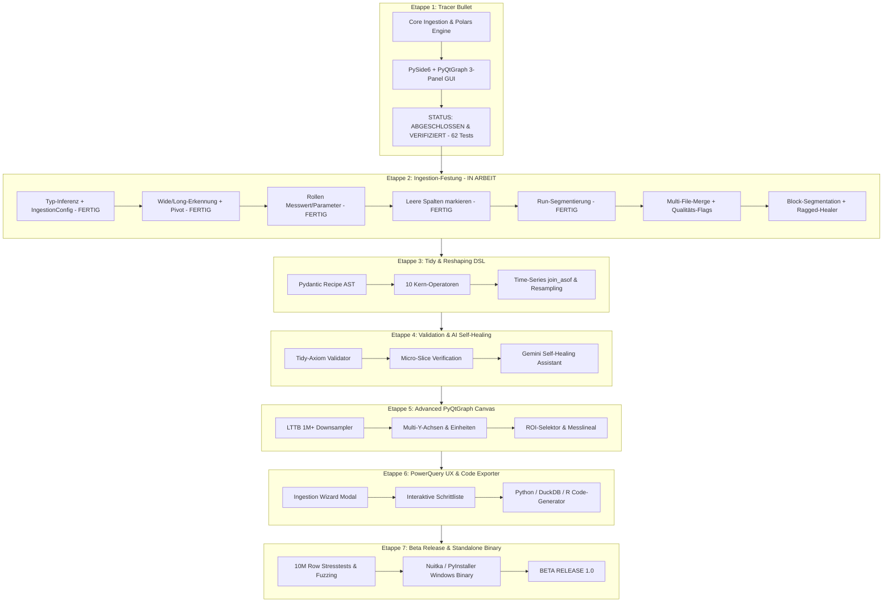

# Datualizer: Master-Etappen-Plan (Vom Fundament bis zum Beta Release 2026)

> **Dokument-Status:** Verbindliche Architektur- und Meilenstein-Referenz für alle beteiligten Entwickler und spezialisierten Agenten.  
> **Projekt:** Datualizer – High-Performance Tidy Data Wrangling & Visualization Framework für Sensor- und Messdaten.  
> **Technologie-Stack:** Python 3.11+, Polars, Apache Arrow, PySide6 (Qt 6), PyQtGraph, Pydantic v2, pytest.

---

## Architektur-Übersicht & Leitprinzipien

1. **Realdaten-Priorität (Robustness First):**
   Reale Messdaten (Prüfstände, Datenlogger, Sensoren, chemische Konzentrationsmessungen) sind fast nie saubere Rechtecke. Ingestion muss resilient gegenüber Multi-Row-Headern, Metadaten-Blöcken, Footer-Statistiken, Logging-Abbrüchen (ragged rows) und Sensor-Fehlercodes (`ERR*`, `--`, `-9999`) sein.
2. **Dual-Mode Datenhaltung (Wide vs. Long):**
   - **Wide-Format (Primary Engine Mode):** 1 Zeile = 1 Zeitstempel, Sensoren nebeneinander in Spalten. Essenziell für mathematische Modelle ($z = f(x, y)$), Korrelationen, Speichereffizienz und latenzfreies Zero-Copy-Plotting in PyQtGraph.
   - **Long-Format (Tidy Analysis Mode):** On-Demand Schmelzen (`to_long()` / `unpivot`) in `[timestamp, variable, value]` für Faceting, Gruppierungen und Tidyverse-Analysen.
3. **Deklarative Reproduzierbarkeit (JSON-AST Recipe):**
   Keine in-place destruktiven Datenoperationen. Jede Transformation ist ein serialisierbarer AST-Knoten (Undo/Redo, Snapshot-Navigation, Code-Export nach Python/Polars, SQL und R).
4. **Hardware-beschleunigte Visualisierung (60 FPS Native):**
   Hardware-Rendering über Qt Graphics View / OpenGL via PyQtGraph mit synchronisierten X-Achsen und LTTB-Downsampling. Keine Browser-Overheads oder Chromium-IPC-Latenzen.

---

---

## Meilensteine im Detail

### ✅ Etappe 1: Minimal End-to-End Tracer Bullet (ABGESCHLOSSEN)
*Status: 100% implementiert und verifiziert (62 von 62 Tests grün)*
- **Core Engine:**
  - `PreScanner`: Erkennung von Trennzeichen (`,`, `;`, `\t`), deutschem Dezimalkomma (`24,109`), Tausendertrennzeichen, UTF-8 BOM, Spalte-0-Header-Lücken und leeren Footer-Zeilen (Zeile 4933).
  - `CSVLoader`: Polars-Ladeengine, Konvertierung von Zeitstempeln (`HH:MM:SS`, ISO, Deutsch) in relative Sekunden (`time_seconds`), non-strict Float-Casting mit `AuditLog`.
  - `DualModeDataset`: Zero-Copy NumPy-Views (`to_numpy(col, allow_copy=False)`) für PyQtGraph, on-demand Tidy `to_long()`.
  - Operatoren: `clean_names` (Umlaut-Transliteration, Kanalkennungs-Erhalt), `drop_footer`, `unpivot`.
- **Desktop GUI (PySide6 + PyQtGraph):**
  - Virtuelles `PolarsTableModel` für ruckelfreies Scrollen ohne Speicherduplikation.
  - `MultiChannelPlotCanvas` mit verlinkten X-Achsen (`setXLink`), dynamischem Ein-/Ausblenden und synchronisiertem Fadenkreuz (Crosshair) mit Live-Multikanal-Wertanzeige.
  - `InspectorPanel` mit Metadaten, Kanalliste und Error-Audit-Badge.
  - `RecipePanel` mit Modus-Umschaltung ("Wide View" vs. "Tidy Melt").
  - `DatualizerMainWindow` mit integriertem 3-Panel Docking-Layout.
  - Getestet auf `SA_testmessung_1.csv` (4.931 Datenzeilen, 8 Kanäle).

---

### 🧱 Etappe 2: Die Ingestion-Festung für chaotische Realdaten (IN ARBEIT)
*Ziel: Kein Messgeräte-Export bringt Datualizer zum Absturz oder verfälscht still die Daten.*

> **Umpriorisiert (2026-10-04)** auf Basis echter Pipeline-Exporte, siehe [`DATENKATALOG_RUNS_EXPORT.md`](DATENKATALOG_RUNS_EXPORT.md).
> Die Probleme realer Daten lagen bei **Semantik und Qualität** (Typen, Rollen, Duplikate, Plausibilität), nicht in der Dateistruktur.
> Leitprinzip: **Automatik schlägt vor, Nutzer entscheidet.** Jede Heuristik ist über `IngestionConfig` überschreibbar, jede Entscheidung steht replaybar in `ingestion_spec`.

1. ✅ **Typ-Inferenz pro Spalte:** NUMERIC / IDENTIFIER / CATEGORICAL; nur numerische Kanäle werden gecastet, auditiert und geplottet (P4, P5).
2. ✅ **`IngestionConfig`:** Vokabulare, Schwellen, Spalten-Overrides, Long-Format-Rollen; aufgelöste, replaybare `ingestion_spec`.
3. ✅ **Wide/Long-Erkennung + Pivot:** Erkennung über Header und Datenform statt Dateiname; Kanal-Attribute (`unit` …) in `channel_attrs` (P1, P19).
4. ✅ **Rollen Messwert vs. Parameter** (P7): `ColumnKind.PARAMETER` für numerische Spalten, die in jedem Run konstant sind; Runs und Erkennung über `RoleConfig`, Overrides über `column_kinds`.
   ✅ **Leere Spalten markieren** (P9, P19): `fill_ratio` und `empty_columns`, markiert statt gelöscht; leere Kanäle werden nicht geplottet. ⏳ Parameter ohne Einheit (braucht P20).
5. ✅ **Run-Segmentierung:** `ds.runs` (Samples, Dauer, Median-Δt, Parameter, `aborted`), `channel_availability`, `run_time()`, `select_run()`; Run-Tabelle und Run-Filter im Inspector (P10, P11, P18).
6. ⏳ **Multi-File-Merge mit Dedupe:** Hash-Erkennung, überlappende Snapshots (P2, P3).
7. ⏳ **Qualitäts-Flags** als separate Spalten: Lücken, Dropout, Sprünge, eingefrorene Sensoren, unplausible Werte (P12–P17).
8. ⏳ **Block-Segmentation** (Metadaten-Kopf, Multi-Row-Header, Footer-Statistiken) und **Ragged-CSV-Healer**, sobald Gerätedaten mit Kopfblöcken vorliegen.
9. ⏳ **Encoding-Matrix** (UTF-16, CP1252) sowie Spektren- und Matrix-Exporte.

---

### 🔄 Etappe 3: Die vollständige Tidy- & Reshaping-DSL-Engine (JSON-AST)
*Ziel: Ein lückenloser, mathematisch sauberer 10-Operatoren-Katalog.*
1. **Pydantic Recipe AST:**
   - Serialisierbares JSON-Schema (`recipe.json`) mit strikter Parameter-Validierung.
   - Idempotente Ausführung, Snapshot-State, Undo/Redo und Replay-Fähigkeit.
2. **Die 10 Kern-Operatoren:**
   - `crop_table(start_row, end_row, start_col, end_col)`: Zuschneiden beliebiger rechteckiger Bereiche.
   - `collapse_headers(rows, sep, clean)`: Mehrzeilige Header hierarchisch verschmelzen (`[Sensor 1, °C]` $\rightarrow$ `sensor_1_degc`).
   - `pivot_longer(id_vars, value_vars, names_to, values_to)`: Unpivot in Tidy-Long-Format.
   - `pivot_wider(id_cols, names_from, values_from, agg_fn)`: Pivotieren in Wide-Format mit Kollisionsauflösung.
   - `split_column(col, pattern, into, remove)`: Regex-Extraktion zusammengesetzter Attribute.
   - `normalize_entities(entity_name, key_cols, attr_cols)`: 3NF-Splitting redundanter Dimensionen in verknüpfte Tabellen.
   - `clean_names()`: Bereinigung von Bezeichnern.
   - `fill_missing(cols, strategy)`: Forward-Fill (LOCF) / Backward-Fill für langsam getaktete Statussignale.
   - `filter_rows(predicate)`: Filtern nach Schwellwerten, Rauschausschluss, Einschwingphasen.
   - `math_transform(col, expr, new_col)`: Kalibrierkurven ($y = m \cdot x + b$) und physikalische Umrechnungen.
3. **Zeitreihen-Ausrichtung (`join_asof` & Resampling):**
   - Zusammenführen von Sensoren mit asynchronen Taktraten (z. B. 100 Hz Temperatur + 1 Hz Druck + Event-Trigger) über konfigurierbare Zeittoleranzen ($\Delta t$).

---

### 🛡️ Etappe 4: Tidy-Axiom-Validation & AI Self-Healing Loop
*Ziel: Automatische Fehlererkennung und KI-gestützte Reparatur fehlerhafter Daten.*
1. **Micro-Slice & Axiom-Checker:**
   - Validierung jedes Transformationsschritts zuerst auf einer 50-Zeilen-Mikrokopie, anschließend auf der Gesamttabelle.
   - Axiom-Prüfungen:
     - Keine Messwerte in Headern.
     - Eindeutigkeit der Primärschlüssel nach `pivot_wider`.
     - Atomarität der Zellenwerte.
     - Typen-Homogenität nach Reshaping.
2. **LLM Self-Healing Assistant (Gemini API):**
   - Kompakter Token-Payload: Erste 15 Zeilen, erkannte Datentypen, Fehler-Traceback.
   - Strikte JSON-Ausgabe: Gemini generiert Pydantic-validierte JSON-Aktionsketten (kein unkontrollierter Freitext).
   - Automatischer Feedback-Loop: Wenn ein Pivot zu Schlüsselkollisionen führt, repariert Gemini das Recipe automatisch mit der passenden Aggregationslogik.

---

### 📈 Etappe 5: High-Performance Visualisierungs-Suite (PyQtGraph Advanced)
*Ziel: Ruckelfreies 60-FPS-Erlebnis bei mehr als 1 Million Messpunkten.*
1. **LTTB (Largest-Triangle-Three-Buckets) Downsampling:**
   - Intelligente Reduktion von $10^6$ Datenpunkten auf $2.000$ Pixelpunkte unter exakter Bewahrung aller Minima, Maxima und Peaks.
2. **Multi-Y-Achsen & Einheiten-Gruppierung:**
   - Automatische Gruppierung von Kanälen nach physikalischer Einheit (z. B. Subplot A: Alle Temperaturen in °C; Subplot B: Alle Drücke in bar).
   - Unterstützung für primäre und sekundäre Y-Achsen (Left/Right Y-Axis).
3. **Interaktive Analysetools:**
   - ROI (Region of Interest) Selektor für Zeitfenster-Ausschnitte.
   - Differenz-Messlineal ($\Delta t$, $\Delta y$, Steigung $dy/dt$).
   - Synchronisierte Hüllkurven (Min/Max-Bänder und gleitender Mittelwert).

---

### 🖥️ Etappe 6: Vollständige Desktop-UX & Code Exporter (PowerQuery-Ergonomie)
*Ziel: Mächtig wie PowerQuery, intuitiv wie Excel.*
1. **Interaktiver Ingestion-Wizard:**
   - Modal-Dialog mit Rohdaten-Preview, automatischer Block-Erkennung und manueller Korrekturmöglichkeit per Klick (Header-Zeile wählen, Delimiter überschreiben).
2. **Visueller Recipe-Editor (Schrittliste):**
   - Drag & Drop zum Umsortieren von Transformationsschritten.
   - Schrittweises Anklicken zeigt den Zustand der Daten nach dem jeweiligen Schritt (Time-Travel Debugging).
3. **Multi-Target Code-Generator:**
   - **Python / Polars:** Exportiert das vollständige Recipe als autarkes Python-Skript.
   - **DuckDB SQL:** Exportiert Reshaping- und Transformationsabfragen als performantes SQL.
   - **R Tidyverse:** Exportiert den Workflow als R-Skript (`library(tidyr)`, `library(dplyr)`).
   - **Datenexport:** Export nach Parquet, Feather/Arrow IPC oder sauberem Tidy-CSV.

---

### 🚀 Etappe 7: Beta Release Härtung, Benchmarks & Standalone-Packaging
*Ziel: Ein schlüsselfertiges Produkt für Test- und Produktionsumgebungen.*
1. **Stresstests & Fuzzing:**
   - Benchmarking auf 10 Millionen Zeilen (Speicherverbrauch, Ladezeiten, FPS).
   - Fuzzing mit synthetisch korrumpierten CSV/TXT-Dateien.
2. **Standalone Windows Binary:**
   - Paketierung als portable Windows `.exe` / Installer via Nuitka oder PyInstaller (keine Python-Installation auf dem Zielrechner erforderlich).
3. **Dokumentation & Release:**
   - Ausführliches Benutzerhandbuch mit Screenshots.
   - Beispieldatensätze (`SA_testmessung_1.csv`, Konzentrationsmessungen, Prüfstandsexporte).
   - GitHub/GitLab CI Pipeline für automatisierte Builds.

---

## Richtlinien für spezialisierte Agenten

> Verbindliche, aktuelle Agenten-Regeln stehen in [`AGENTS.md`](../AGENTS.md). Die folgenden Punkte sind ein Auszug.

- **Schnittstellen-Verträge beachten:** Jede Datenübergabe zwischen Ingestion, Pipeline und GUI nutzt `DualModeDataset` bzw. das Pydantic `RecipeAST`.
- **Zero-Copy vorziehen:** Für PyQtGraph immer NumPy/Arrow-Views ohne Speicherduplikation verwenden (`df[col].to_numpy()`).
- **Nicht-destruktiv arbeiten:** Keine In-Place-Mutationen von DataFrames; jede Operation erzeugt einen neuen Pipeline-Schritt.
- **Automatisierte Verifikation:** Vor jedem Meilenstein-Abschluss müssen alle Unit- und Integrationstests (`pytest -v`) nachweisbar grün durchlaufen.
